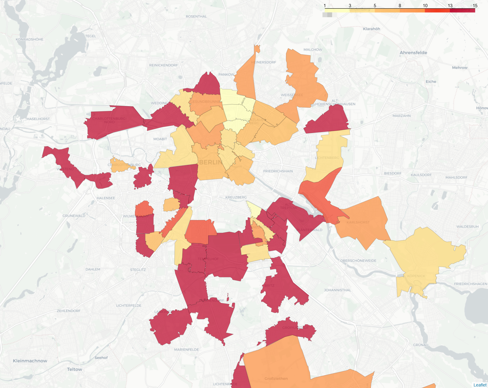
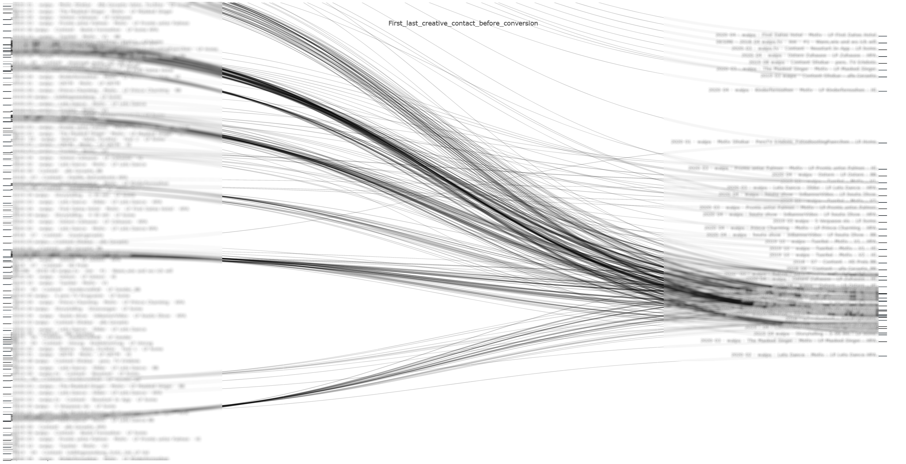
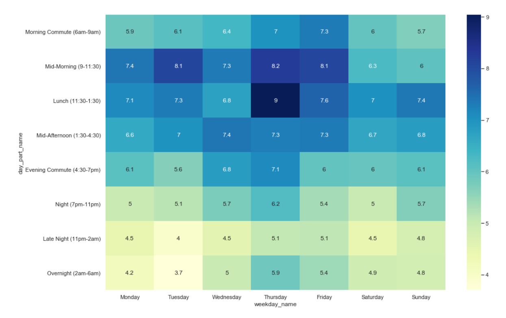
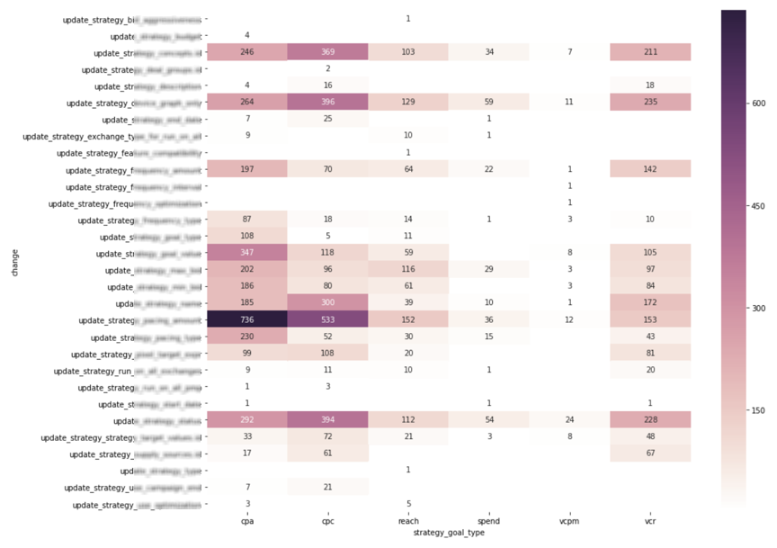
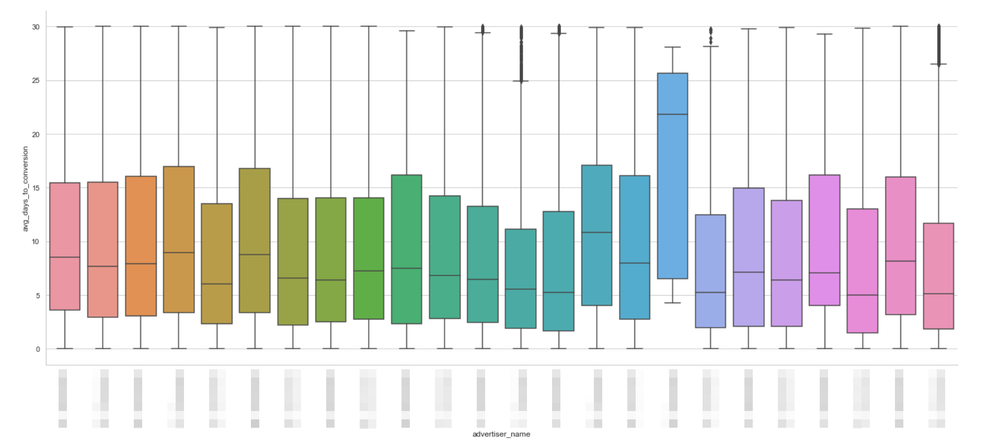

# data_vizualisations

**Collection of visualisation scripts:**

# Zip code vs KPIs (CPA, ROI, RR, CPC)

- usefull for recognition geo specific performance patterns which might be used for targeting refinement by Hyperlocal and Digital Out of Home campaigns:

# Creative paths

# Heat maps 

- Day parts

- Change logs

# Box plots

